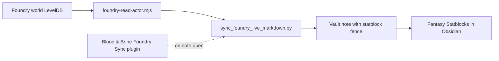

# Foundry VTT bridge

## What you use at the table



| Step | What |
|------|------|
| 1 | Junction `Foundry/world-actors` → Pi world `data/actors` (LevelDB) |
| 2 | Notes declare `foundry_actor_id` (registry script) |
| 3 | Open a linked note — plugin syncs that note, or run Python manually |
| 4 | **Fantasy Statblocks** renders the ` ```statblock ` fence in Live Preview |

### Per-note sync (default)

**Settings → Blood & Brine Foundry Sync → Sync on note open** runs:

`python scripts/sync_foundry_live_markdown.py --note-only "<this note>"`

Command palette: **Sync Foundry statblock (current note)** · **Sync Foundry statblocks (all notes)**

Requires plugin enabled + Foundry world DB reachable on this PC.

### Manual commands

```bash
python scripts/sync_foundry_live_markdown.py --note-only "World/Factions/Marines/Commander Leon.md"
python scripts/sync_foundry_live_markdown.py
python scripts/sync_foundry_actor_registry.py
python scripts/sync_foundry_statblocks.py   # workshop kits only
```

## Folder map

| Folder | What | Live at table? |
|--------|------|----------------|
| `Foundry/world-actors` → world `data/actors` | Foundry LevelDB | **Yes** (sync source) |
| `Foundry/actors-json` → workshop `foundry-json` | Import/build templates | No |

### Setup (once)

```powershell
New-Item -ItemType Junction -Force `
  -Path "D:\Documents\GitHub\blood&brine\Foundry\world-actors" `
  -Target "D:\foundry-pi\Foundry\foundrydata\Data\worlds\blood-and-brine\data\actors"
```

Note frontmatter:

```yaml
foundry_actor_id: CRzQHL4mLXxZFybo
foundry_live_slug: commander-leon      # optional
foundry_template_json: Foundry/actors-json/leon.json  # workshop only
```

## Obsidian plugins

1. **Fantasy Statblocks** (`obsidian-5e-statblocks`) — **required** for rendering
2. **Blood & Brine Foundry Sync** (`.obsidian/plugins/blood-brine-foundry-statblock/`) — optional automation

Enable both under **Settings → Community plugins**, then reload Obsidian.

## Editor-only

`Foundry/` is hidden in the file explorer (see [[docs/obsidian-setup]]) and not published to GitHub Pages. Junction targets are gitignored.
